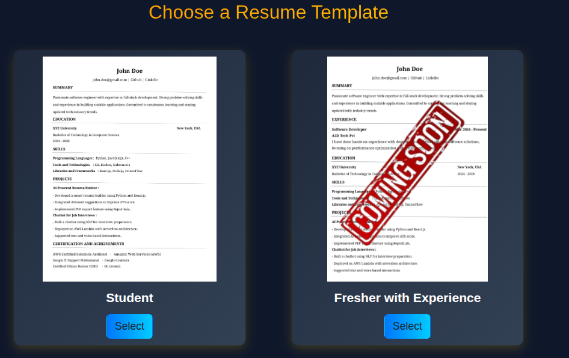
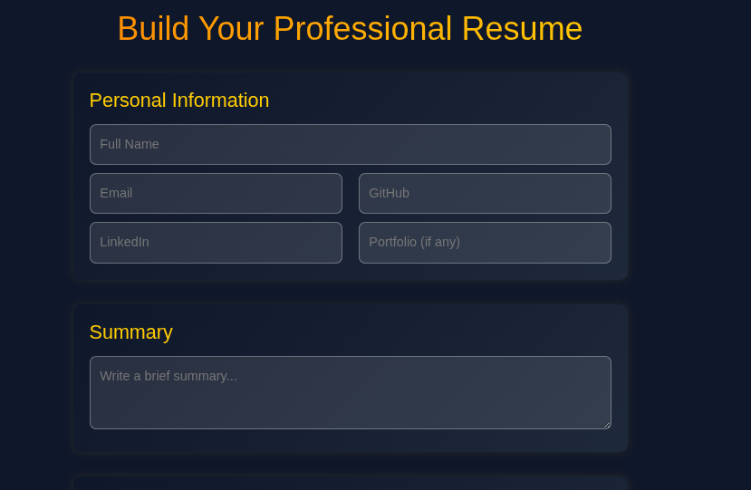
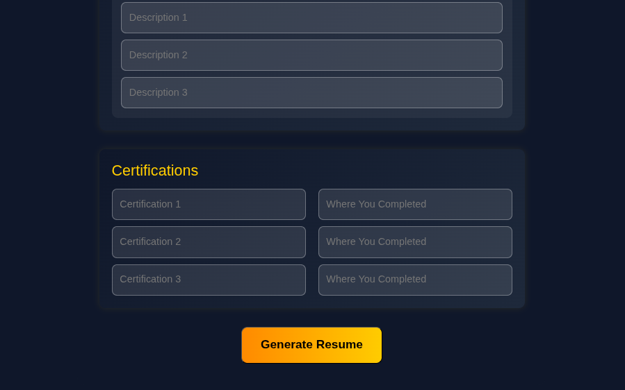
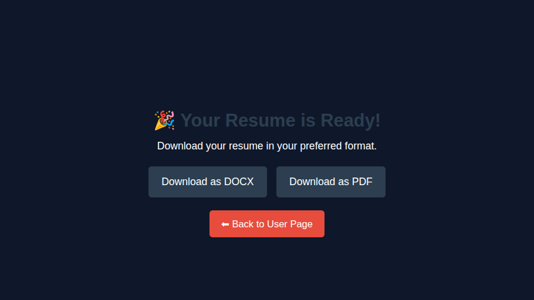

# 📝 Resumon – Resume Builder

**Resumon** is a **Python-based application** that generates professional resumes by taking user input and automatically updating predefined **DOCX templates**, with the additional capability to **export as PDF** if needed. It is designed to help students and professionals quickly create **ATS-friendly resumes** with structured formatting.

---

## 🌟 Features

- 📄 **Automated Resume Generation**  
  Generates resumes by filling a predefined DOCX template with user-provided data.

- 📝 **DOCX & PDF Export**  
  Users can download their resume as a **Word (.docx) file** or download it to **PDF** for job applications.

- 💡 **Customisable Templates**  
  Easily switch between different resume templates as per role requirements.

- ⌨️ **Interactive User Input**  
  Takes user data such as personal details, education, skills, and projects.

- 🗃️ **File Handling & Document Templating**  
  Uses `python-docx` for DOCX editing and `reportlab`  for PDF generation.

---

## 🛠️ Tech Stack

- **Language:** Python
- **Libraries:** python-docx, reportlab (for PDF export)

---

## 🚦 How It Works

1. User runs the application  
2. Inputs personal information, education, skills, and project details  
3. Application updates the predefined DOCX resume template with user data  
4. Saves the updated resume as:
   - 📄 **DOCX file** for further edits  
   - 📑 **PDF file** ready for direct submission

---

## 📸 Screenshots

### 🔹 Home


### 🔹 Template


### 🔹 Fill Information



### 🔹 Download


---
## ▶️ Getting Started

### ⚙️ Clone the Repository

```bash
git clone https://github.com/yogesh5055/resumeon.git
cd resumeon

